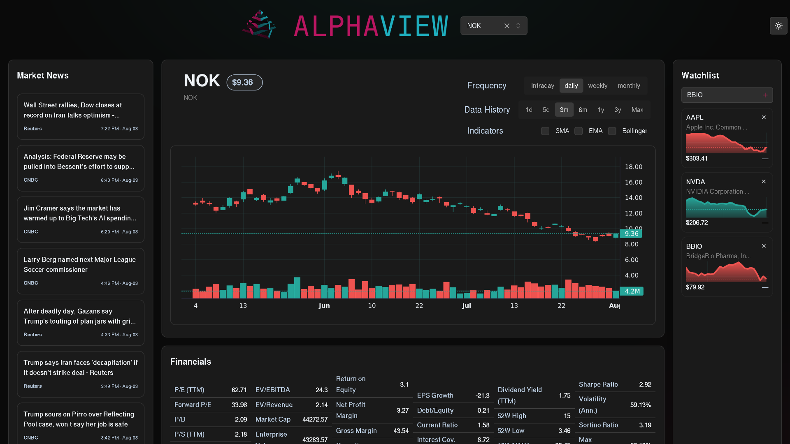

# AlphaView

A self-hosted financial dashboard for real-time market data, news, and stock analytics.



## Features

- Real-time and historical price charts with SMA, EMA, and Bollinger Band indicators
- Live price feed for any ticker
- Persistent watchlist with live prices and intraday mini charts
- Stock financials and quantitative metrics (Sharpe, Sortino, volatility, max drawdown, VaR)
- Market news feed
- Dark-themed UI

## Tech Stack

- **Frontend:** React, TypeScript, Mantine, Lightweight Charts, Vite
- **Backend:** Node.js, Express, TypeScript, SQLite
- **Data:** Alpaca Market Data API, Finnhub API
- **Deployment:** Docker Compose

## Getting Started

### Prerequisites

- [Docker](https://docs.docker.com/engine/install/) with the Compose plugin
- Free API keys from [Alpaca](https://alpaca.markets/) (required) and [Finnhub](https://finnhub.io/) (for news/financials)

### Setup

```bash
git clone git@github.com:KodeUniverse/alpha-view.git
cd alpha-view

cp .env.example .env
```

Edit `.env` and add your API keys:

```env
HOST_PORT=1337
HOST_API_PORT=9001
ALPACA_API_KEY=your_alpaca_key
ALPACA_API_SECRET=your_alpaca_secret
FINNHUB_API_KEY=your_finnhub_key
FINNHUB_API_SECRET=your_finnhub_secret
```

### Run

```bash
make start
```

Open `http://localhost:1337` in your browser.

## Commands

| Command      | Description                       |
|--------------|-----------------------------------|
| `make build` | Build all Docker images           |
| `make start` | Start services with live file sync |
| `make stop`  | Stop all services                 |
| `make restart` | Rebuild and restart all services |
| `make clean` | Stop and remove all containers    |
